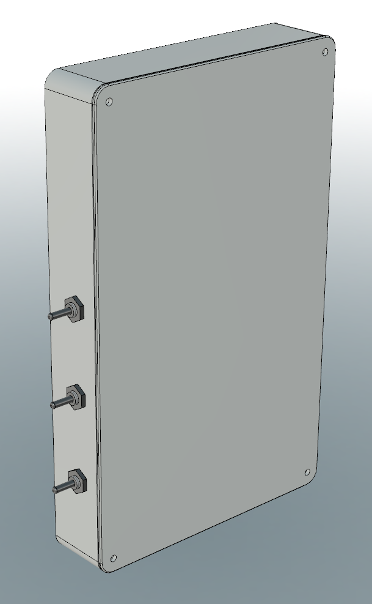
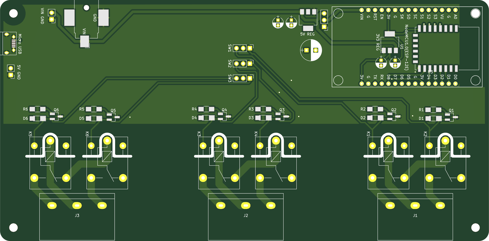
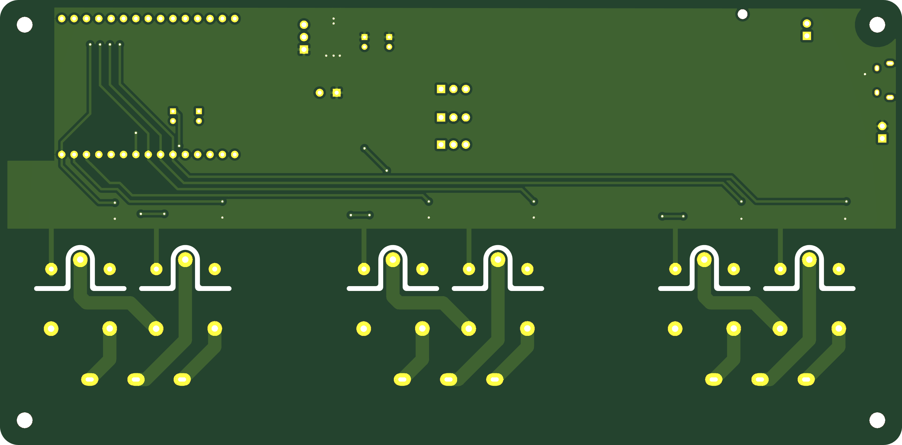
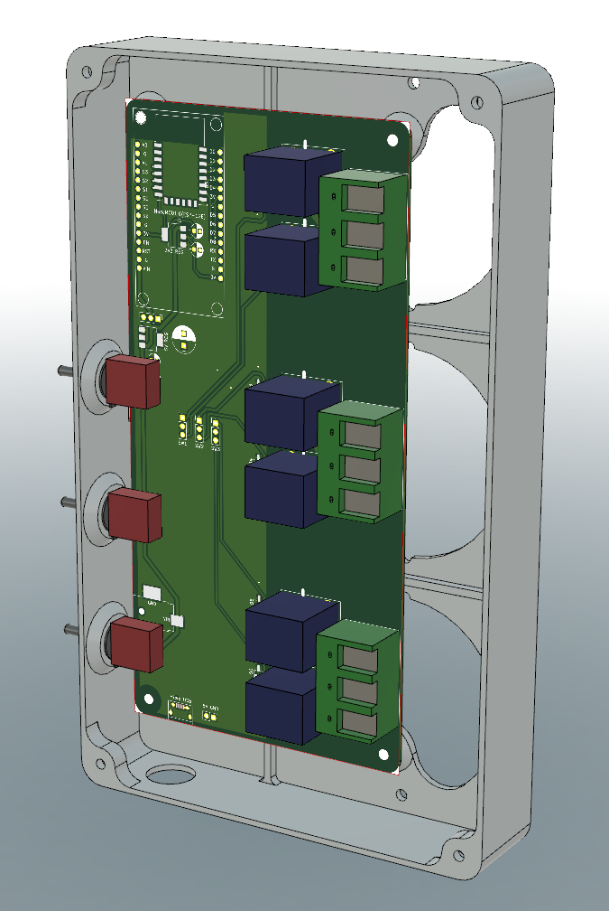

# Window Roller Shutter Control 3-gang with ESP8266

This project contains a 3-gang electric/motorized window roller shutter control
based on an ESP8266. The following resources are included:

* Full schematics and PCB designs
  * in KiCAD 5 with all footprints
  * generated Gerber files ready to send to PCB manufacturer
  * exported as PDF file
* Microcontroller ESP8266 firmware source code
  * with WiFi connectivity and remote over-the-air update
  * for control via MQTT and a web interface
* 3D-printable enclosure
  * in 3MF and STL file formats

## Hardware

This projects was designed to control 3 independent electric roller shutter
motors, each with a hot (live) and two switched directional wires (L1 for "up"
and L2 for "down"). Existing manual switches need to be removed and the motor
cables are wired to screw terminals on the PCB. Two relays per roller shutter
control the direction: up or down. The circuit and the relay type ensure that
only one direction is possible at a time. The relays open before closing
(break-before-make), and both relays are arranged "in series" to control the
motor direction.

The PCB and enclosure are designed to fit around an existing 3-gang 60mm switch
box. Any common 3-gang switch plate for this size can be replaced by the PCB and
enclosure, given that each switch box is 72mm apart from its neighbor switch
box. The enclosure mounts flush against the wall and is secured by multiple
screws into the switch box behind it.

Since not every roller shutter provides a neutral (return) wire, an external
5-24VDC power supply (wall plug) is used to power the ESP8266 and relays on PCB.
This securely separates low-voltage from high-voltage, also see separation slots
on the PCB. Multiple footprints are on the PCB to feed in DC low-voltage.

Momentary toggle switches can be added to manually control the roller shutters,
independent of the ESP8266 or automation. The enclosure is designed for 6mm
toggle switches. They control the relays low-voltage side and override signals
from the ESP8266.

### Bill of Material

For the PCB assembly:

* 1x NodeMCU module for ESP8266, or ESP-12E module (requires additional components)
* 3x HB-9500 3P screw terminal, 9.5mm pitch
* 6x SRD-05VDC-SL-C relay, 5VDC control, opening before closing, 10A@250VAC
* 6x NPN transistor, footprint SOT-23, 2N3904 or similar
* 6x 220 Ohm resistor, footprint 1206
* 6x flyback diode, footprint 1206, 1N4001 or similar
* 3x MTS-123 On-Off-On toggle switch
* 1x 5V DC-DC voltage regulator, footprint SOT-223-3, AMS1117-50 or similar
* 1x 3.3V DC-DC voltage regulator if ESP-12E is used, footprint SOT-223-3, AMS1117-33 or similar
* 1x suitable power supply for 5VDC, at least 10W
* optional: capacitors as needed per voltage rail

For the enclosure and mounting:

* 8x M3 nut
* 4x M3x12 bolts
* 2x 3.2mm switch box screws (optional, up to 6x)

### Wiring

Each roller shutter is controlled by two relays accessible via a 3-way screw
terminal block. The center connection is the hot / live wire. The outer
connections are the directional L1 and L2 wires. If you roller shutters is
moving in the wrong direction, e.g., up instead of down, simply reverse the
wires on the outer connections on the this screw terminal block.

The toggle switches are wired in a similar way: the center pin is the common
connection, and the two outer pins control the up or down signal to the ESP8266.

The ESP8266 ESP-12E module needs an external 3.3V regulator, while the NodeMCU
module has one built in and only needs a 5V input (see available footprints on
the PCB). Various footprints for decoupling capacitors are available and can be
populated.

## Firmware / Control Software

The ESP8266 microcontroller can be flashed with the provided PlatformIO-based
firmware project. It controls the following functions:

* WiFi connectivity
* MQTT connection
  * with status updates being published to `window_shutter_status` topic
  * with action commands being subscribed to on the `window_shutter` topic
* Web interface
  * to invoke commands via a browser-based UI
  * similar actions as via MQTT
* Over-the-air updates

All credentials and configuration is placed in `include/credentials.h`, see the
included template file for structure and variable names: WiFi SSID and
passphrase; MQTT server, username and password; and optional an OTA password.

After power-up and connecting to a WiFi network, the web-based UI is available
on the assigned IP address via HTTP (port 80). It is a simple frontend for the
following HTTP calls:

* `/action?q=...` with `...` being an action or preset
  * `1u` or `1up` to move the first shutter up
  * `1d` or `1down` to move the first shutter down
  * `2u` or `2up` to move the second shutter up
  * `2d` or `2down` to move the second shutter down
  * `3u` or `3up` to move the third shutter up
  * `3d` or `3down` to move the third shutter down
  * `preset_work`, `preset_normal`, `preset_night` activates one of the hardcoded presets
  * `s` or `stop` is the same as `/stop`
* `/stop` to stop all roller shutters by disabling the relays
* `/restart` to restart the ESP8266 microcontroller

Similar to the web UI, an MQTT connection is established after power-up and two
topics are use:

* status updates are published to `window_shutter_status`
  * contains state change messages and debug information
* commands can be published to `window_shutter` for the ESP8266 to act upon with a payload
  * `1u` or `1up` to move the first shutter up
  * `1d` or `1down` to move the first shutter down
  * `2u` or `2up` to move the second shutter up
  * `2d` or `2down` to move the second shutter down
  * `3u` or `3up` to move the third shutter up
  * `3d` or `3down` to move the third shutter down
  * `preset_work`, `preset_normal`, `preset_night` activates one of the hardcoded presets
  * `s` or `stop` to stop all roller shutters by disabling the relays
  * `restart` to restart the ESP8266 microcontroller

See [PlatformIO](https://platformio.org/) for more information on how to get
started, compile, and upload the firmware.

Quick development commands:

* compile and verify the code: `platformio run`
* compile and upload the code: `platformio run --target upload`
* get a serial console of the device: `platformio device monitor`

## Caveats

During power-up of the ESP8266, some pins might change state and trigger a relay
to close, before the firmware sets the correct state. This momentary change can
activate the roller shutter for a fraction of a second but is not happening
during normal operation.

If the used power supply is not capable of providing enough switching current
when the relays activate, you can bump up the input voltage to 7.5 or 9VDC, or
add more capacitance on the regulated 5VDC rail.

The toggle switches directly activate the relay, bypassing the
ESP8266-controlled transistors. However, due to the "in series" arrangement of
both relays, if the ESP8266 sends a "down" signal, a toggle switch might not be
able to override it in one direction.

When using an ESP-12E module, extra pull-up or pull-down resistors might be
needed (no footprints on the PCB). The NodeMCU module can be inserted into
standard 2.54mm headers and works with only a 5VDC input voltage.

## License

This project is made available under the MIT License. For more details, see the
``LICENSE`` file in the repository.

## Author

This project was created by Thomas Kriechbaumer.
